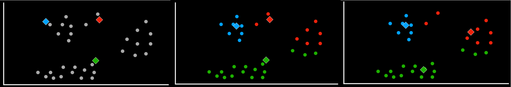
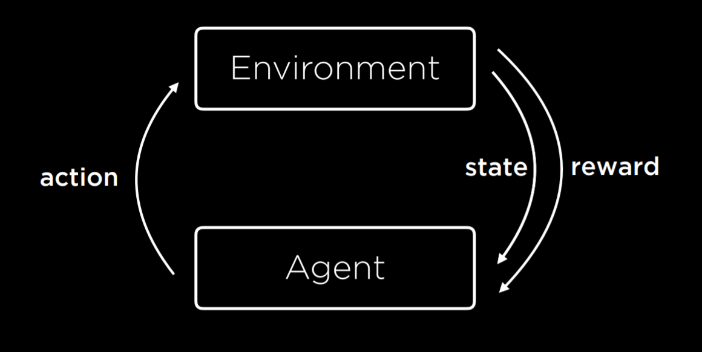

# <h1 align='center'> 🎉 CS50AI 2023 🎉</h1>

 CS50's Introduction to Artificial Intelligence with Python repository.

 

   

# Projects

## Search Problems

Search problems can be modeled as an `agent` within an `environment`. This agent has an initial `state (S)`, and after fulfilling an `action (A)`, ends up in a resulting new state (resembling a `transition model`). The objective is to go from an `initial state` to an `end state` after a series of `actions`. As we'll realize, several problems can be thought of as a `search problem` as well.

`TODO`: cite frontier and node as main data structures that help understand these solutions.

|               [Degrees](01-search/project/degrees/srs)               |          [Tic-Tac-Toe](01-search/project/tic-tac-toe/src)          |
| :------------------------------------------------------------------: | :----------------------------------------------------------------: |
|  |  |
|                         Nodes and Frontiers                          |                          MinMax Strategy                           |
|                         Breadth First Search                         |                         Adversarial Search                         |
|                          Depth First Search                          |                         Alpha-Beta Pruning                         |

## Knowledge

`TODO`: Talk about knowledge representation, how proposition logic is important (and we usually ignore, don't see applications and so on) and how inference is interesting and powerful.

`TODO`: Talk about resemblance with search problems: given state and action leading to an inferred new proposition.

|              [Knights and Knaves](02-knowledge/project/knights/)               |                 [Minesweeper](02-knowledge/project/minesweeper/)                  |
| :----------------------------------------------------------------------------: | :-------------------------------------------------------------------------------: |
|  |  |
|                               Proposition Logic                                |                             Knowledge representation                              |
|                                                                                |                                     Inference                                     |

## Dealing with Uncertainty

`TODO`: Talk about bayes-rule, bayesian network, probability distribution, markov chains, transition model.

|                [Pagerank](03-uncertainty/project/pagerank/)                |              [Heredity](03-uncertainty/project/heredity/)               |
| :------------------------------------------------------------------------: | :---------------------------------------------------------------------: |
|  |  |
|                            Random Surfer Model                             |                            Bayesian Network                             |
|                                Markov Chain                                |                        Probability Distribution                         |

## Optimization Strategies

`TODO`: Talk about the different types of optimization strategies.

`TODO`: Talk about concepts similar to previous learnings, frontiers (available worlds), neighbors, resemblance with search and knowledge engineering and representation.

|                     Local Search (Hill-Climbing)                     |                Linear Programming (Lagrange Multipliers)                 |           Constraint Satisfaction Problem (CSP)           |
| :------------------------------------------------------------------: | :----------------------------------------------------------------------: | :-------------------------------------------------------: |
|  |  |  |

`TODO`: Specify that sudoku was an independent project. Deepen on Constraint Satisfaction Problems and how modeling a sudoku was the tough part. Node Consistency was easy, Arc consistency was tough.

|       [Crossword](04-optimization/project/crossword)       |               [Sudoku](04-optimization/project/sudoku)               |
| :--------------------------------------------------------: | :------------------------------------------------------------------: |
|  |  |
|                      Node Consistency                      |                Modeling (Variable, Row, Column, Box)                 |
|                      Arc Consistency                       |                      Restriction Representation                      |
|                       AC3 Algorithm                        |                             Backtracking                             |

## Learning from Data

`TODO`: Talk about the simplicity of shopping. That it should not be considered as a real-life example of what a classification problem look like - explain why (load-data, missing, data pipeline, so on)

`TODO`: discussion on reinforcement-learning problem. Talk about the interesting (philosophically speaking) part concerning the fact that a `learning step`, so to speak, is composed at the same time by a `reward` **AND** a `punishment`, because the AI both wins and lose at the same time.

|       [Shopping](05-learning/project/shopping/)        |             [Nim](05-learning/project/nim/)             |
| :----------------------------------------------------: | :-----------------------------------------------------: |
|  |  |
|            Nearest-Neighbor Classification             |                 Reinforcement Learning                  |
|                  Perceptron Learning                   |                       Q-Learning                        |
|                Support Vector Machines                 |
|                     Loss Functions                     |
|                      scikit-learn                      |

## Neural Networks Concepts

`TODO`: Talk about neural networks architectures. Image convolution and max-pooling strategies. Dropout for regularization, how it may avoid over-reliance on specific weights.

| [Traffic](06-neural-networks/project/traffic/)  |     |
| :---------------------------------------------: | :-: |
|  |     |
|              Activation Functions               |     |
|                Gradient Descent                 |     |
|           Multilayer Neural Networks            |     |
|                 Backpropagation                 |     |
|                   TensorFlow                    |     |
|          Convolutional Neural Networks          |     |
|            Recurrent Neural Networks            |     |

## Natural Language Ideas

`TODO`: Talk about language structures, context-free grammar, applications on classification and topic modeling (with a nice simple application using only tf-idf for it (not complex LDA or stuff like that)), word representation as basis of a high-dimensional field, distributed representation and how word2vec represents words that appear in the same context more often as closer vectors in this distriuted dimension.

|          [Parser](07-language/project/parser/)           |       [Questions](07-language/project/questions/)        |
| :------------------------------------------------------: | :------------------------------------------------------: |
|  |  |
|                   Context Free Grammar                   |                      Term Frequency                      |
|                                                          |                Inverse Document Frequency                |
|                                                          |                      Markov Chains                       |
|                                                          |                     Word Embeddings                      |
|                                                          |                         word2vec                         |
|                                                          |                       Transformers                       |
